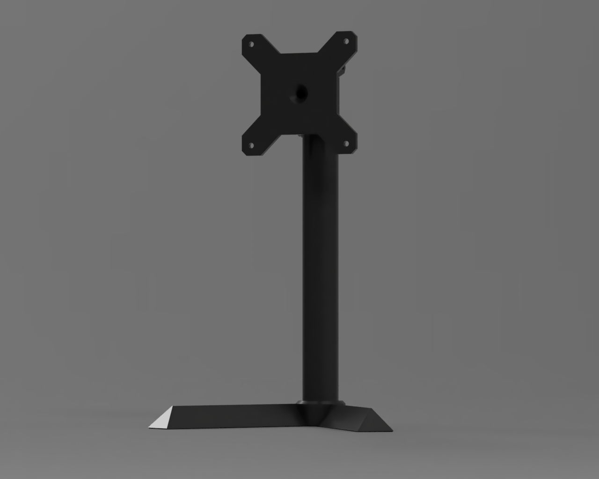
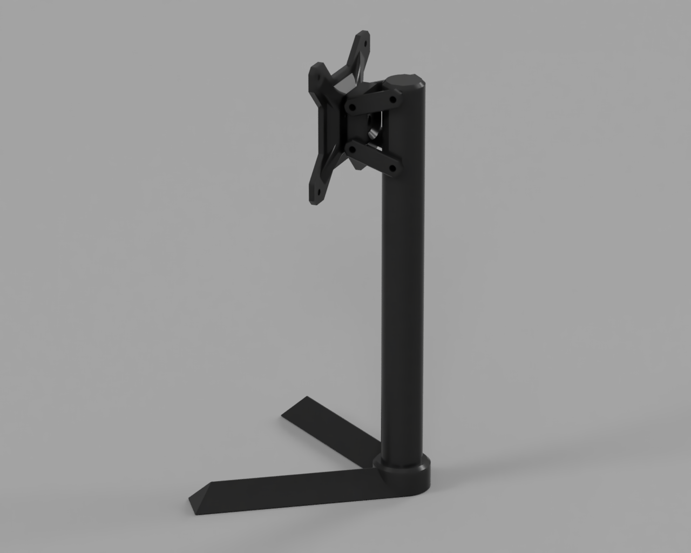
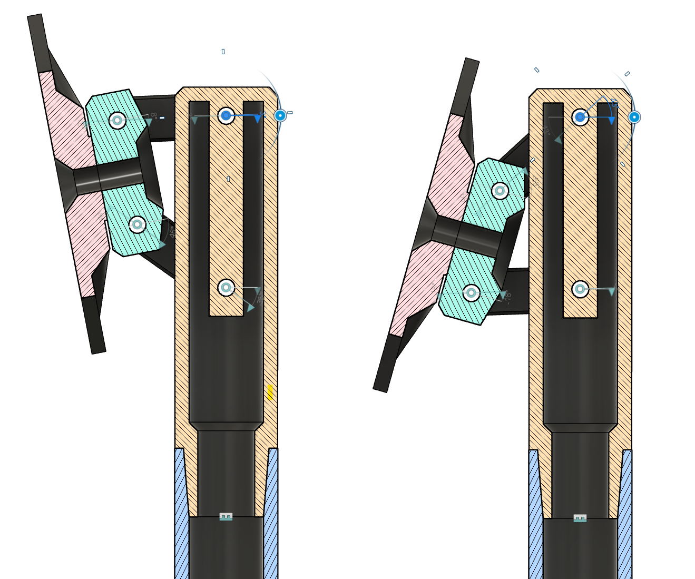

# Modern VESA Articulated Stand

## Overview
The **VESA Articulated Mount** is a versatile and agile monitor support system designed to allow rotation and inclination along all three axes. This project leverages the articulated parallelogram mechanism to provide stable and precise adjustments for your monitor. The mount is specifically engineered to be 3D printable and easy to assemble with just a few common hardware components.

## Features
- **3D Printable**: All parts are designed for 3D printing.
- **Simple Assembly**: Assembles with four M6 screws and nuts, and one M8 countersunk screw and nut.
- **Versatile Adjustments**: Allows for smooth rotation and inclination in all three axes.
- **Tested Compatibility**: Successfully tested with a 24" Asus VN247 monitor.

## Components
- 3D printed parts
- 4 x M6 screws and nuts
- 1 x M8 countersunk screw and nut

## Assembly Instructions
1. Print all necessary parts using a 3D printer.
2. Assemble the parts using the M6 screws and nuts.
3. Use the M8 countersunk screw and nut for the main pivot point.
4. Attach the assembled mount to your monitor using the standard VESA mounting holes.

## Usage
The VESA Articulated Mount is perfect for anyone looking to enhance the flexibility and ergonomics of their monitor setup. Whether you're using it for a home office, gaming station, or professional workspace, this mount provides the adjustability you need for optimal viewing angles.

## License
This project is licensed under the MIT License. The author does not assume any responsibility for damages to property or persons.

## Contributing
Contributions are welcome! Please fork this repository and submit a pull request with your improvements or bug fixes.

## Contact
For any questions or feedback, please open an issue or reach out to me directly.

Enjoy your new versatile monitor setup!
